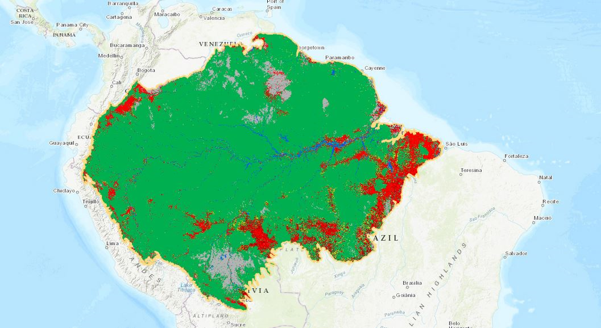

# South_American_Deforestation-
Final Project for UC Davis Boot Camp 2021

### GROUP PROJECT 5

To classify whether forests in South America (Brazil in particular) is growing or shrinking. 
We will be analyzing data sets to find out what contributes to deforestation or growth.
Using Machine learning, we can then predict whether the forest for Brazil will be classified as growing or not.  We are planning on using a combination of clustering and Regression analysis. 
To visualize, we will use Tableau to plot the graphs of the scale of the forests.

We will utilize the following data sets:

* We got our data sets for forest data per country in South America used to represetn and graph current forest condtions:
https://www.datarepository.movebank.org/handle/10255/move.837
https://ourworldindata.org/forest-area#how-much-of-the-earth-s-surface-is-forested

* We found and downloaded the data for deforestation factors, this gives a good generilztion of deforestaion:
https://www.kaggle.com/chiticariucristian/deforestation-and-forest-loss

### Objective

After assembling the dataset, we will be using pandas and pycaret to create cluster and regrston analysis of the amzon rainforest per a country. We will create a prediction model to predict the rainforest size per a country in South America.

We will use the the Brazil data set to train a logistic model: 

http://terrabrasilis.dpi.inpe.br/app/map/deforestation?hl=pt-br

We will use:

https://www.kaggle.com/balraj98/deepglobe-land-cover-classification-dataset?select=test to train data to underatnad mapping data. 

We plan to build our own image libary of past 20 years of satalite images of the Amazon to create a cluster model:

https://eos.com/blog/free-satellite-imagery-sources/ 

We will then create a dashboard page with a dropdown menu that will allow for a user to select which Country they want to investigate. We will also use Tableau to make map visulizations. 
These visualiztions will show past current and predicted future forest inforamtion. We plan to map and graph these. 

# My Personal contribution to the group project

### Latitude Longitude Model

Here we analyzed the graphs based on ml models, and  researched the spread of deforestation within a 10 year period. We used Pycaret for lat and lon models as targets in each of the notebooks. 
Residuals were used in our machine learning model as they served as differences between observed and predicted values of data. 

### Residuals for Extra Trees Regressor Model: 

the graph showed a pattern in the distribution of residuals, the pattern is symmetrical, Test and Train  R-Squared Values are high.
The Prediction Error tried to represent the Data Mining vs Model Building.

### Prediction Error for Extra Trees Regression: 
the graph showed that our prediction and our model coincides with R-Squared Value of 0.996.

### Prediction Error for Random Forest : 
the graph showed that there is a non-significant variance/ variation between our prediction and our model, with R Squared 0.98.

### For Lat model: 
the best result showed Light Gradient Boosting Model with R-squared score      of 0.99. Other models Extra Trees Regressor, Random Forest and Decision Tree Regressor also showed high R-Squared Value.

### Lon model:  
the best models showing high R-Squared values turned to be the same as for Lat model, they were  Random Forest Regressor, Extra Trees Regressor, Light Gradient Boosting Machine.

### Feature importance Plot
referred us  to assign a score to t features based on how useful they are at predicting a target variable.Here states played a higher variable importance.

### Residuals for Random Forest Regressor Model: 
the graph showed slightly different distribution on the positive and negative side according to the x-axis. There were outliers which make the residual distribution less symmetrical in comparison to Residuals for ExtraTrees Regressor Model.

### To conclude on Lat and Lon model: 
we can state that choosing them as targets in machine learning mode was effective and it enabled us to visualize and interpret the results in Tableau.
We decided to create a machine learning model to  define Lat and Lon and visualize the results in Tableau and - like that- to  analyze the spread of deforestation within  10 years. 

### For prediction of future deforestation based on timeline and lon/lat
we went for XGBoost which is an efficient fast highly flexible algorithm and   it works well in small to medium dataset. Our Brazilian dataset can be considered small. The first visualization displays the current condition with deforestation in Brazil. The future prediction model showed that during the next 10 years the area of deforestation based on lon and lat,  on a big scale, will remain the same, new concentrated deforestation areas will appear. What is more important -- the process of deforestation is not showing any tendency to decrease. We also tried to define  the next 1000 deforestation  locations based on predicted lon and lat. As we can see these new areas will also appear within the current main designated deforestation area. They are here on the map.

Talking about data limitations:  the data set is only for Brazil and does not incorporate major technological environmental or political impacts. 

We plan to develop and expand our project with  drone photography besides satellite images used in our current project. And to consider possible deforestation advantages vs disadvantages for Brazil economy.

